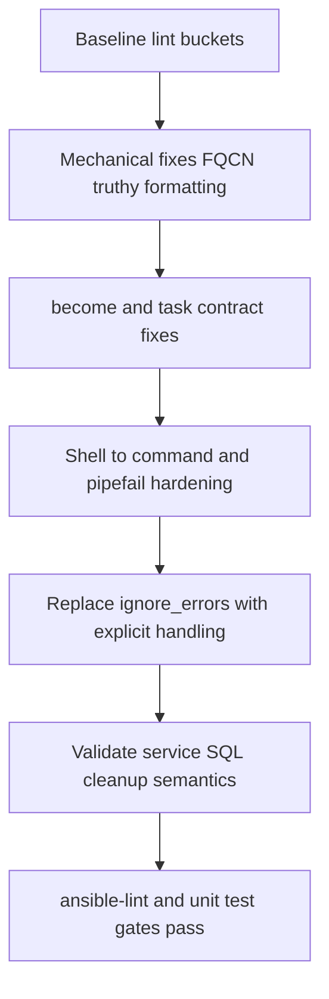

# Ansible Lint Root-Cause Remediation Plan

## Scope and intent

- Primary targets: `[setup.yml](setup.yml)` and `[teardown.yml](teardown.yml)`.
- Validation path: `[06_run_unit_tests.sh](06_run_unit_tests.sh)` and `[tests/sh/06_run_unit_tests.bats](tests/sh/06_run_unit_tests.bats)`.
- Constraint: no blanket suppression; every rule should be fixed at source unless there is a proven semantic mismatch with project policy.

## Current failure shape

- Most failures cluster into repeated root causes:
  - Missing FQCN module names (`ansible.builtin.*`, `community.*`).
  - `yes`/`no` truthy YAML values.
  - Shell misuse (`command-instead-of-shell`, `risky-shell-pipe`, missing/incorrect idempotency signals).
  - `ignore_errors` overuse.
  - `become_user` without task-level `become`.
  - Formatting noise (trailing spaces, extra blank lines, name casing/template hygiene).

## Remediation strategy (ordered to minimize risk)

### 1) Mechanical, low-risk normalization first

- Normalize YAML booleans to `true`/`false` across both playbooks.
- Remove trailing spaces / excessive blank lines and fix name casing/template placement issues.
- Convert all builtin modules to FQCN (`ansible.builtin.fail`, `ansible.builtin.debug`, `ansible.builtin.shell`, etc.).
- Convert collection modules to FQCN (`community.general.homebrew`, `community.postgresql.*`).

### 2) Privilege and task contract correctness

- Add `become: true` anywhere `become_user` is used.
- Keep read-only probes explicitly non-mutating with `changed_when: false`.
- Add explicit `failed_when` contracts where rc handling is intentional.

### 3) Shell hygiene and idempotency hardening

- Replace `shell` with `ansible.builtin.command` where no shell features are required.
- For unavoidable shell pipelines, add `set -o pipefail` and explicit failure/change conditions.
- Remove unconditional `changed_when: true` on SQL execution tasks; derive change/failure semantics from command output/rc or move to PostgreSQL module equivalents where behavior is preserved.

### 4) Remove broad failure suppression safely

- Replace each `ignore_errors` with one of:
  - `failed_when: false` + explicit post-check/assert,
  - `block`/`rescue` for best-effort teardown sections,
  - guarded `when` conditions to avoid impossible operations.
- Preserve operator visibility by recording and reporting non-fatal teardown issues instead of silently suppressing them.

### 5) High-risk behavior-sensitive sections (treat explicitly)

- Service/process management (`brew services`, process checks/kills): ensure stop/start semantics and reporting remain correct after shell refactors.
- SQL bootstrap execution in `[setup.yml](setup.yml)`: maintain same execution order and auth behavior when improving lint compliance.
- Trash-based cleanup logic in `[teardown.yml](teardown.yml)`: keep non-destructive move-to-trash behavior intact while hardening shell/lint compliance.

### 6) Suppression policy (exception-only)

- Suppression is acceptable only if all are true:
  - A root-cause fix would materially change required runtime semantics,
  - No equivalent Ansible-native implementation exists without regressions,
  - The suppression is narrow (single task/rule), documented inline with rationale, and paired with compensating checks.
- Any proposed suppression should include before/after behavior evidence and a concrete revisit trigger.

## Verification gates

- Run `ansible-lint setup.yml teardown.yml` and confirm zero failures.
- Run `./06_run_unit_tests.sh` and ensure Ansible lint suite passes with existing Bats suites still green.
- Smoke-run syntax checks (`ansible-playbook --syntax-check`) for both playbooks.
- Optionally run a setup/teardown dry run against a local test target to confirm no behavioral regressions in service lifecycle and SQL bootstrap.

## Execution sequence summary

